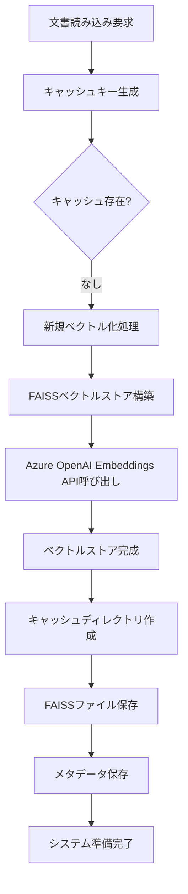
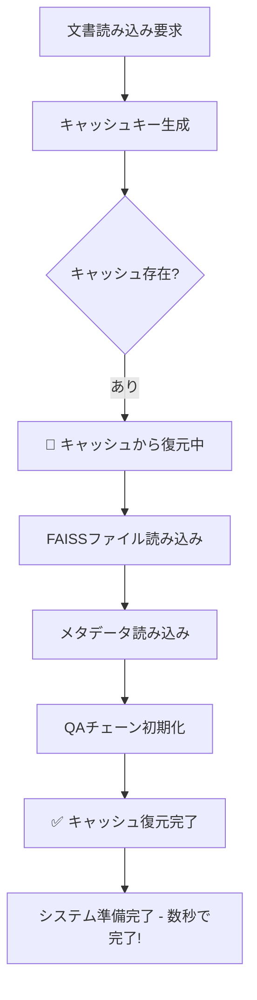

# FAISSベクトルストア自動キャッシュシステム

## 概要

このRAGシステムでは、文書のベクトル化処理を一度だけ実行し、結果を自動的にキャッシュして再利用する仕組みを実装しています。これにより、同じ文書に対する処理時間を大幅に短縮し、Azure OpenAI APIの呼び出し回数とコストを削減できます。

## システムの効果

### 🚀 パフォーマンス向上
- **初回処理**: 10,000チャンクの文書で約5-10分
- **2回目以降**: 同じ文書を数秒で読み込み
- **API呼び出し削減**: ベクトル化APIを再実行せず、ローカルキャッシュを使用

### 💰 コスト削減
- Azure OpenAI Embeddings APIの重複呼び出しを完全回避
- 大容量文書での大幅なコスト削減効果

## 技術実装詳細

### 1. キャッシュキー生成システム

```python
def _get_file_cache_key(self, document_path: str) -> str:
    """
    ファイルのキャッシュキーを生成
    """
    # URLの場合はそのままハッシュ化
    if document_path.startswith(('http://', 'https://')):
        content = document_path
    else:
        # ローカルファイルの場合はパス+サイズ+更新時刻でハッシュ化
        file_path = Path(document_path)
        stat = file_path.stat()
        content = f"{document_path}_{stat.st_size}_{stat.st_mtime}"
    
    return hashlib.md5(content.encode()).hexdigest()
```

**キャッシュキーの構成要素:**
- **ファイルパス**: 文書の一意識別
- **ファイルサイズ**: ファイル変更の検出
- **最終更新時刻**: 内容変更の自動検出
- **MD5ハッシュ**: 32文字の一意キー生成

### 2. ファイル変更の自動検出

文書ファイルが更新された場合、以下の情報が変化してキャッシュキーが自動的に変わります：

```
example.pdf (初回)    → キー: a1b2c3d4...
example.pdf (編集後) → キー: e5f6g7h8... (自動的に別キー)
```

これにより、文書が更新された場合は自動的に新しいベクトル化処理が実行されます。

### 3. キャッシュディレクトリ構造

```
./cache/
├── a1b2c3d4e5f6g7h8/          # MD5ハッシュキー
│   ├── index.faiss            # FAISSベクトルインデックス
│   ├── index.pkl              # FAISSメタデータ
│   └── metadata.txt           # 文書情報
├── b2c3d4e5f6g7h8a1/          # 別文書のキャッシュ
│   ├── index.faiss
│   ├── index.pkl
│   └── metadata.txt
└── ...
```

### 4. メタデータ管理

各キャッシュディレクトリには`metadata.txt`が保存され、以下の情報を記録：

```txt
document_path: /path/to/example.pdf
document_name: example.pdf
pages: 150
chunks: 1500
total_characters: 254780
```

## 自動キャッシュのフロー

### 初回処理フロー



### 2回目以降の高速復元フロー



## コード実装の詳細解説

### 1. load_document()メソッド - メインロジック

```python
def load_document(self, document_path: str, doc_type: str = "auto") -> None:
    # 文書名を取得
    document_name = self._get_document_name(document_path)
    
    # キャッシュキーを生成
    try:
        cache_key = self._get_file_cache_key(document_path)
        cache_path = self.cache_dir / cache_key
        
        # 既存キャッシュをチェック
        if cache_path.exists() and (cache_path / "metadata.txt").exists():
            # キャッシュから復元
            logger.info(f"📂 キャッシュから復元中: {document_name}")
            self.load_vectorstore(str(cache_path))
            
            # メタデータを読み込み
            metadata = self._load_document_metadata(cache_path)
            self.current_document_info = metadata
            
            # QAチェーンを初期化
            self.qa_chain = RetrievalQA.from_chain_type(...)
            
            logger.info(f"✅ キャッシュ復元完了: {document_name}")
            return
            
    except Exception as e:
        logger.warning(f"キャッシュキー生成失敗: {e}")
        # キャッシュが使えない場合は新規処理を続行
    
    # 新規ベクトル化処理
    logger.info(f"📄 新規ベクトル化開始: {document_name}")
    
    # ... 新規処理ロジック ...
    
    # 自動キャッシュ保存
    try:
        self.save_vectorstore(str(cache_path))
        self._save_document_metadata(cache_path, document_path)
        logger.info(f"💾 キャッシュ保存完了: {document_name}")
    except Exception as e:
        logger.warning(f"キャッシュ保存失敗: {e}")
```

### 2. FAISSベクトルストアの保存・復元

```python
def save_vectorstore(self, save_path: str) -> None:
    """ベクトルストアを保存"""
    if not self.vectorstore:
        raise ValueError("ベクトルストアが初期化されていません")
    
    self.vectorstore.save_local(save_path)
    logger.info(f"ベクトルストアを保存しました: {save_path}")

def load_vectorstore(self, load_path: str) -> None:
    """保存されたベクトルストアを読み込み"""
    self.vectorstore = FAISS.load_local(
        load_path, 
        embeddings=self.embeddings,
        allow_dangerous_deserialization=True  # 自分で作成したキャッシュファイルなので安全
    )
    
    # QAチェーンを再初期化
    self.qa_chain = RetrievalQA.from_chain_type(...)
    
    logger.info(f"ベクトルストアを読み込みました: {load_path}")
```

## セキュリティとデータ保護

### 🔒 ローカルファイルシステムでの安全性

1. **完全ローカル処理**: FAISSはネットワーク通信を行わない
2. **自己生成キャッシュ**: システムが自分で作成したファイルのみ読み込み
3. **ハッシュベース**: ファイル内容の変更を自動検出

### ⚠️ 保存データの内容

キャッシュには以下のデータが保存されます：

- **FAISSベクトルインデックス** (`index.faiss`): 数値ベクトルのみ（元テキストは含まない）
- **文書チャンク情報** (`index.pkl`): 分割されたテキストの内容
- **メタデータ** (`metadata.txt`): ファイル名、ページ数などの統計情報

**重要**: ベクトルデータ自体は元のテキスト内容を直接含みませんが、`index.pkl`には分割されたテキストチャンクが含まれています。

### 🛡️ セキュリティ推奨事項

1. **キャッシュディレクトリの保護**: 適切なファイル権限設定
2. **定期的なクリーンアップ**: `clear_cache()`メソッドの活用
3. **機密文書の扱い**: 必要に応じてセッション終了時のキャッシュクリア

## 管理機能

### キャッシュ情報の確認

```python
cache_info = rag_system.get_cache_info()
print(f"キャッシュ数: {cache_info['cache_count']}")
print(f"使用容量: {cache_info['cache_size_mb']}MB")
```

### キャッシュの完全削除

```python
rag_system.clear_cache()  # 全キャッシュを削除
```

## 使用例とログ出力

### 初回実行時のログ

```
📄 新規ベクトル化開始: manual.pdf
文書を読み込み中: /docs/manual.pdf (タイプ: pdf)
150ページ/セクションの文書を読み込みました
テキストを1500チャンクに分割しました
ベクトル埋め込みを生成中... (バッチサイズ: 500, 遅延: 0.1秒)
🔄 合計1500チャンクを3バッチで処理します
⚡ 最高速設定: 500チャンク/バッチ, 0.1秒間隔
💾 キャッシュ保存完了: manual.pdf
✅ 新規ベクトル化完了: manual.pdf
   📊 ページ数: 150, チャンク数: 1500
```

### 2回目以降のログ

```
📂 キャッシュから復元中: manual.pdf
✅ キャッシュ復元完了: manual.pdf
   📊 ページ数: 150, チャンク数: 1500
```

## まとめ

このFAISSベクトルストア自動キャッシュシステムにより：

1. **大幅な処理時間短縮**: 数分→数秒への高速化
2. **APIコスト削減**: 重複ベクトル化処理の完全回避
3. **自動化**: ユーザーが意識することなく最適化が適用
4. **信頼性**: ファイル変更の自動検出による正確なキャッシュ管理

企業環境での大容量文書処理において、パフォーマンスとコスト効率の両面で大きなメリットを提供します。